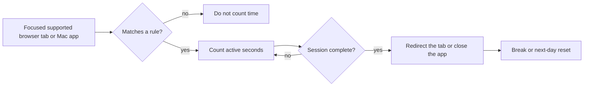

# Lock In

<p align="center">
  
</p>

I built this for the moment when one quick visit or one episode turns into a
session I did not choose. Lock In tracks focused time on the websites and Mac
apps you select, then blocks them when that session is over. The same session,
break, and daily-reset model is also available on iPhone and iPad. On Mac, its
controls live in the standard menu opened from the menu bar icon.



## How it works

Add domains and installed applications, then choose the session length, number
of sessions, break length, and daily reset time. Only a focused matching tab or
frontmost selected app adds time. A five-minute notification comes before the
limit; afterward Lock In redirects matching tabs and closes selected Mac apps.

Sessions can have breaks between them. When the final session is used, the rule
stays blocked until the configured daily reset; otherwise it returns after the
break.

## Things to expect

The Mac app reads and redirects browser tabs through AppleScript Automation.
macOS will ask for permission for each browser. Supported browsers are Safari,
Google Chrome, Arc, Dia, Brave, Microsoft Edge, Vivaldi, Opera, and Chromium.
Firefox does not expose its active tab URL through AppleScript, so it is not in
the focused-tab list. Lock In does not alter DNS, `/etc/hosts`, or a VPN.

App blocking on Mac uses normal workspace/process APIs, including for system
apps such as TV. It works in the current ad-hoc-signed build and needs no Screen
Time entitlement, but an administrator can still quit or remove the blocker.

On iPhone and iPad, app and website selection uses Apple's Family Controls,
Device Activity, and Managed Settings frameworks. Those APIs require the Family
Controls entitlement and a provisioning profile signed by an Apple Developer
team; an unsigned device build cannot enforce Screen Time restrictions. Apple
does not make those frameworks available to native macOS apps, so the platform
UIs and enforcement adapters remain separate even though they follow the same
policy model.

This is a commitment aid, not an unbreakable restriction for the same Mac
administrator who installed it. The source includes notes on the stronger
managed and system-level approaches in `docs/enforcement-architecture.md`.

## Install and run

The Mac app requires macOS 14 or newer and Xcode command-line tools.

```sh
git clone https://github.com/vladkalinichencko/Lock-In.git
cd 'Lock In'
./script/build_and_run.sh --install
```

The build creates the menu bar app and its guardian, then installs and launches
the app. Build and test without installing it with:

```sh
swift build
swift test
```

## Status

This is a source-available prototype while I test the idea in real life. It has
no license grant yet, and a future product version may use different terms.
