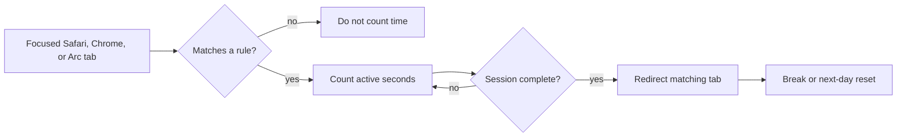

# Lock In

<p align="center">
  
</p>

I built this for the moment when one quick visit turns into a session I did not
choose. Lock In is a small macOS menu bar app that tracks focused time on the
sites you name, then sends the matching tab to a block page when that session
is over.



## How it works

Add a domain, choose the session length, number of sessions, break length, and
daily reset time. Only a frontmost supported browser with a focused tab matching
that domain or a subdomain adds time. A five-minute notification comes before a
limit, and the app blocks the matching tab once the allowance is used.

Sessions can have breaks between them. When the final session is used, the rule
stays blocked until the configured daily reset; otherwise it returns after the
break.

## Things to expect

The prototype reads and redirects browser tabs through AppleScript Automation.
macOS will ask for permission, and it currently supports Safari, Google Chrome,
and Arc. It does not alter DNS, `/etc/hosts`, or a VPN configuration.

This is a commitment aid, not an unbreakable restriction for the same Mac
administrator who installed it. The source includes notes on the stronger
managed and system-level approaches in `docs/enforcement-architecture.md`.

## Install and run

Requires macOS 14 or newer and Xcode command-line tools.

```sh
git clone https://github.com/vladkalinichencko/Lock-In.git
cd 'Lock In'
./script/build_and_run.sh --install
```

The build creates the menu bar app and its guardian, then installs and launches
the app. Build and test without installing it with:

```sh
swift build
swift test
```

## Status

This is a source-available prototype while I test the idea in real life. It has
no license grant yet, and a future product version may use different terms.
